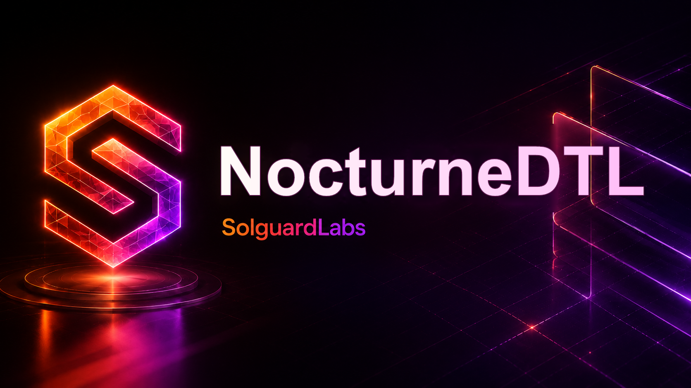

# NocturneDTL



NocturneDTL es un nucleo Rust para privacidad contable en redes DTL. El sistema
modela posiciones economicas privadas mediante commitments, nullifiers internos,
balances agregados y retiros contra vaults de liquidacion.

El repositorio esta pensado como una base de auditoria tecnica: expone flujos de
deposito, rotacion de ventanas, consumo de commitments, retiros y reconciliacion
agregada sin requerir servicios externos.

## Componentes

- `src/privacy.rs`: construccion determinista de commitments y nullifiers.
- `src/ledger.rs`: orquestacion de depositos, spends, retiros y eventos.
- `src/reconcile.rs`: reportes agregados del estado contable.
- `src/scenario.rs`: contrato JSON usado por tests y simulaciones.
- `tests/node`: tests de integracion sobre el binario Rust.

## Requisitos

- Rust estable compatible con edition 2021.
- Node.js 20 o superior para la suite JavaScript.

## Uso

Ejecutar una simulacion desde stdin:

```bash
cargo run --quiet -- --json < tests/fixtures/example.json
```

Ejecutar tests:

```bash
cargo test --locked
npm test
```

Validacion completa local:

```bash
bash scripts/ci.sh
```

## Contrato JSON

El binario acepta un documento con una lista `operations`. Cada operacion puede
abrir ventanas, registrar activos, depositar fondos, rotar notes, gastar
commitments, retirar saldo interno o emitir una reconciliacion.

La salida contiene notes publicas, recibos, snapshot agregado y reportes de
reconciliacion. Los secretos de apertura se mantienen dentro de la simulacion y
solo se referencian mediante etiquetas de escenario.

## Estado

El lab compila como crate Rust y se valida mediante tests JavaScript de caja
negra. La documentacion publica describe el comportamiento esperado del sistema y
los controles operativos que un equipo de protocolo revisaria durante una
auditoria.
